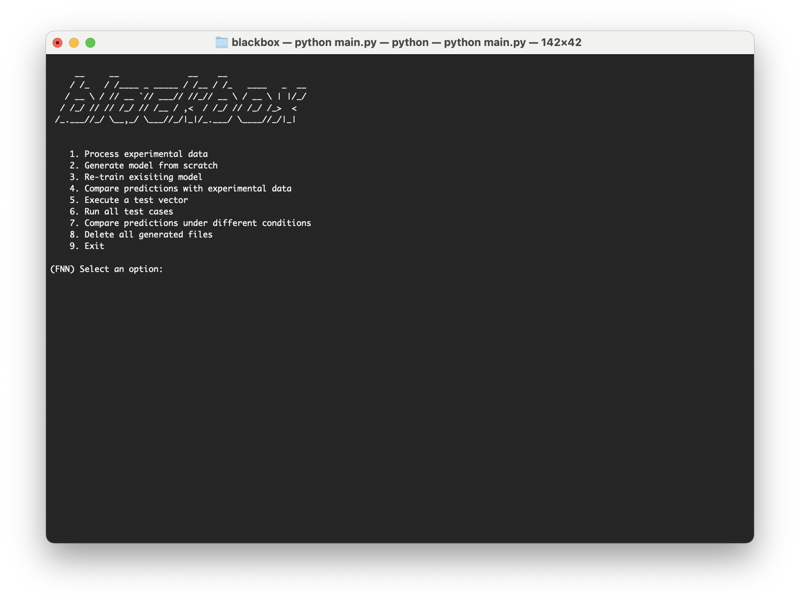
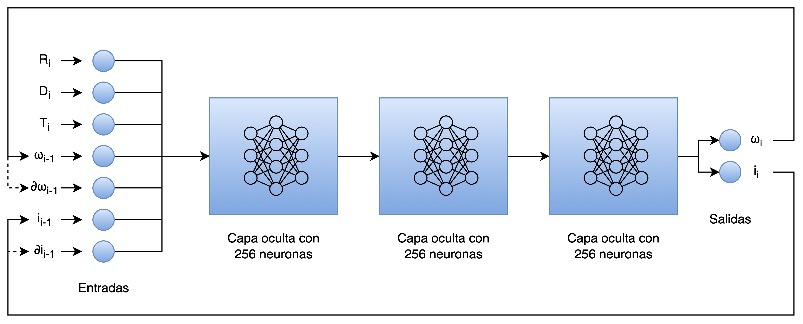
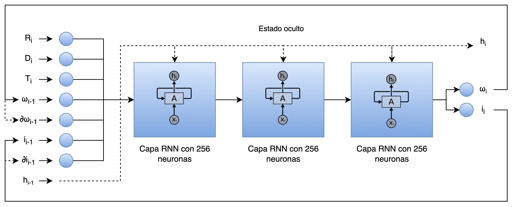
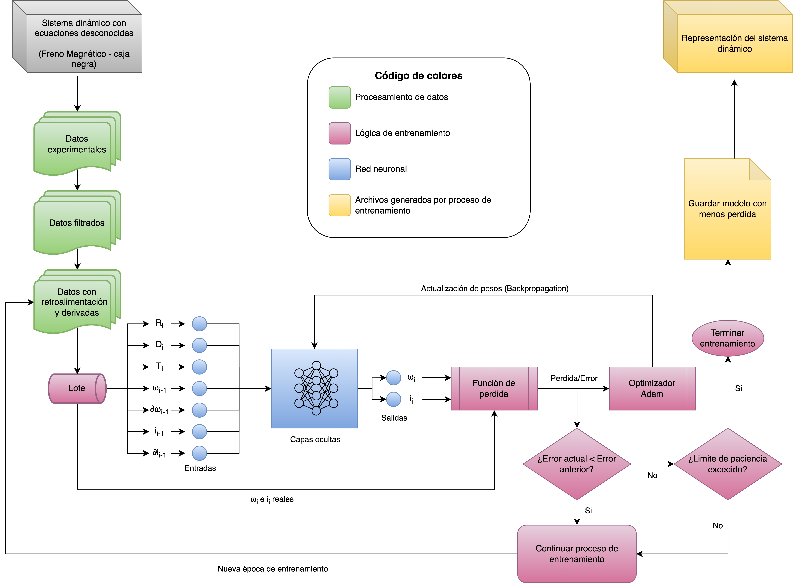

# Blackbox

This project is a Python-based implementation of Feed-Forward Neural Networks (FNN) and Recurrent Neural Networks (RNN) for modeling dynamical systems. The project is part of a thesis focusing on the application of neural networks to model a magnetic braking system (also known as an Eddy current brake) and its dynamical behavior based **only** on experimental data readings.

Both architectures are wrapped in a **NARX** (Nonlinear AutoRegressive with eXogenous inputs) formulation: at every timestep the network sees the exogenous inputs together with its own previous output(s) and a small set of finite-difference derivatives. This lets a fundamentally static MLP behave like a discrete-time dynamical system — and lets the RNN variant lean on both its internal hidden state *and* an explicit feedback signal.

The architecture is designed to be versatile. The same pipeline can model any system whose inputs and outputs can be measured; only [`data_processing.py`](utils/data_processing.py) needs to be adapted to a new dataset.



### Requirements

- Python 3.8 or newer (originally developed against 3.8.17; works on 3.10+).
- The libraries listed in `requirements.txt` — PyTorch, NumPy, pandas, SciPy, scikit-learn, Matplotlib, Seaborn, imageio, Pillow.

### Installation

```bash
git clone https://github.com/alex-spataru/blackbox
cd blackbox
pip install -r requirements.txt
```

### Usage

Run the interactive launcher:

```bash
python main.py
```

If only one config file is present under `cfg/`, it's auto-selected; otherwise you'll be prompted. The menu exposes the full pipeline — preprocess raw data, train from scratch, retrain an existing checkpoint, compare predictions against experimental data, execute a test vector, run all test cases (and produce a GIF), or clean up generated files.

#### Prediction/experimental data comparison

In practice **the RNN backbone outperforms the FNN by a wide margin** on this dataset — lower closed-loop validation loss, cleaner trajectory shapes, and noticeably better robustness on held-out runs. Unless you have a deployment constraint that rules out a recurrent op (an embedded target with no state, ONNX export limitations, etc.), prefer `cfg/RNN.json`. The FNN configuration remains in the repo as a baseline and as a sanity check that the training framework itself is sound.

The animation below shows the RNN's closed-loop predictions across every test case in sequence:


### NARX formulation

At each timestep `t` the model consumes a feature vector of the form

```
x_t = [ u_t , y_{t-1} , Δy_{t-1} , Δ²y_{t-1} , ... ]
```

where `u_t` is the vector of exogenous inputs at time `t` (the things you control or measure independently — reference, distance, temperature) and the remaining terms are the model's previous output and its cascaded finite-difference derivatives, controlled by the `num_derivatives` config field. The output `y_t` is then fed back into `x_{t+1}` to form the next input. The derivative terms are how a memoryless MLP captures dynamics that depend on rate-of-change, not just on the current state.

Because the same feedback recipe is used at training and inference (via the shared `compute_feedback_features` helper in [`utils/model_generator.py`](utils/model_generator.py)), the model sees identical features at both times. This means the trained network does not need a wall-clock time input to reproduce the behavior of the system — it generalizes the *dynamics* rather than memorizing trajectories.

Two backbones are supported, selected via the `rnn` boolean in the config:

- **FNN** (`rnn: false`) — pure feed-forward MLP. All temporal memory comes from the NARX feedback features. Stateless across timesteps.
- **RNN** (`rnn: true`) — multi-layer ReLU RNN. Carries an internal hidden state in addition to the NARX feedback features.

**FNN Architecture:**


**RNN Architecture:**


### Training: scheduled sampling and closed-loop validation

The core difficulty with autoregressive models is **exposure bias**: if you train the network with ground-truth feedback at every step (teacher forcing) but then evaluate it in closed loop (its own predictions fed back), small prediction errors compound and the rollout drifts away from anything the network has seen during training.

To bridge that gap, training uses **scheduled sampling**:

1. At each step inside a sequence, the feedback for the *next* step is either the ground truth (probability `p`) or the model's own detached prediction (probability `1 − p`).
2. `p` starts at `scheduled_sampling.start_prob` and decays linearly to `scheduled_sampling.end_prob` over `decay_epochs` epochs.
3. A small Gaussian noise (`feedback_noise_std`) is added to the teacher-forced feedback. This trains the model to tolerate the imperfect feedback it will see at inference and is the single most effective regularizer against autoregressive drift.

Validation and the held-out test split are always evaluated in fully closed-loop mode (`p = 0`), so the metric reflects how the model will actually be deployed. The held-out test loss is printed automatically at the end of training — there is no separate "run on test set" step.

Other training-loop niceties worth mentioning:

- **Split by experiment, not by row.** Each CSV is a single experimental run and lives in exactly one of train / val / test. A `split_manifest.json` is written alongside the model and the held-out CSVs are copied into `held_out_path`, so you can re-run predictions on data the model truly never saw.
- **Derivative-aware loss.** The loss is MSE on the predictions plus MSE on their successive time-derivatives. This penalises shape mismatches in addition to point-wise error.
- **EMA-smoothed validation signal.** Closed-loop validation on small datasets is intrinsically noisy. The training loop applies an EMA (`val_smoothing`) before feeding the val loss into the LR scheduler, the early-stopping counter, and best-model selection — so a single lucky or unlucky epoch can't latch.
- **Gradient accumulation + clipping.** `batch_size` sequences accumulate gradients before each optimizer step. Gradients are clipped to `grad_clip` (5.0 for FNN, 1.0 for RNN — RNNs are more prone to exploding gradients through time).
- **`training_history.json`** records every epoch's raw and smoothed val loss next to the model, so you can plot the run after the fact.

The image below provides an overview of the entire training process:



### Test Vectors

Test vectors are used for validating the generalization capacity of the trained neural network models, below is an example of a test vector that simulates a step function at *t = 3s*:

```
$TIME 10.0
$STEP_SIZE 0.02

$INPUT Reference 3
0.00   0
2.98   0
3.00   100

$INPUT Distance 1
0.00   1.25

$INPUT Temperature 1
0.00   30
```

- `$TIME`: Total simulation time.
- `$STEP_SIZE`: Time step size for the simulation.
- `$INPUT`: Defines an input signal for the simulation.
  - Following the `$INPUT` keyword, the name of the input and the number of points for that input are specified.
  - Each point is then listed with its corresponding time and value.

**Note:** We interpolate between each point to generate a continuous signal over the specified time.  

### Directory Structure

Here is a brief explanation of the project directory structure:

```
blackbox/
│
├── cfg/                     # Configuration files and resources
│   ├── FNN.json             # Configuration file for FNN models
│   ├── RNN.json             # Configuration file for RNN models
│   └── RM42 Magnetic Brake/ # Resources & code related to the magnetic brake
│
├── utils/                   # Utility scripts
│   ├── data_processing.py   # Data preprocessing utilities
│   ├── model_executor.py    # Closed-loop inference (NARX rollout)
│   ├── model_generator.py   # Model definition + training loop
│   ├── plotting.py          # Plotting utilities
│   └── test_vector.py       # Test vector parsing
│
├── outputs/<model>/         # Created at runtime
│   ├── Models/              # Best checkpoint, split_manifest.json, training_history.json
│   ├── Training Data/       # Filtered/normalised CSVs fed into training
│   ├── Held Out/            # Copies of val+test CSVs the model never trained on
│   ├── Test Cases/          # Pre-filter CSVs used for the comparison plots
│   └── Plots/               # PNG/JPG outputs from plotting.py
│
├── CLAUDE.md                # Working notes for AI collaborators (Claude Code)
├── config.py                # Configuration file loader
├── main.py                  # Main script to run the project
└── requirements.txt         # Required libraries
```

#### Configuration files

`cfg/FNN.json` and `cfg/RNN.json` hold every hyperparameter for a training run. You can create additional config files (one per experiment) and the launcher will let you pick between them. The key fields are:

**Data and architecture**

| Field | Meaning |
|---|---|
| `inputs` / `outputs` | Column names of the exogenous inputs and the signals to predict. |
| `num_derivatives` | How many finite-difference derivatives of the feedback to include in `x_t`. |
| `hidden_layers`, `neurons_per_layer`, `dropout_rate` | Backbone size. |
| `rnn` | `true` for the RNN backbone, `false` for the FNN. |
| `normalization_parameters` | Divisor applied to each signal during preprocessing so all targets land in roughly `[0, 1]`. |
| `constant_signals` | Inputs that are held at their per-experiment median (use for quantities that don't vary within a run). |

**Splits and reproducibility**

| Field | Meaning |
|---|---|
| `seed` | RNG seed for PyTorch / NumPy / Python's `random`. |
| `val_ratio`, `test_ratio` | Fractions of the CSV files (not rows) to hold out. |
| `held_out_path` | Where copies of the val+test CSVs are written. |

**Training loop**

| Field | Meaning |
|---|---|
| `max_epochs`, `batch_size`, `learning_rate`, `weight_decay` | Optimizer basics; gradients are accumulated over `batch_size` sequences before each step. |
| `early_stop_patience`, `early_stop_threshold` | Epochs to wait without (smoothed) val improvement before stopping. |
| `lr_scheduler` | `ReduceLROnPlateau` config: `factor`, `patience`, `min_lr`. |
| `grad_clip` | Max L2 norm for gradient clipping (RNNs should keep this around 1.0). |

**NARX-specific knobs**

| Field | Meaning |
|---|---|
| `scheduled_sampling.start_prob` | Teacher-forcing probability at epoch 0. |
| `scheduled_sampling.end_prob` | Teacher-forcing probability after `decay_epochs`. Set to 0.0 to train the model fully closed-loop by the end of training. |
| `scheduled_sampling.decay_epochs` | Epochs over which `p` is linearly annealed from `start_prob` to `end_prob`. |
| `feedback_noise_std` | Std-dev of Gaussian noise added to the teacher-forced feedback. Targets are normalised to ~`[0, 1]`, so `0.01` is ~1% drift. The single most useful knob against autoregressive drift. |
| `val_smoothing` | EMA factor in `[0, 1)` applied to the validation loss before it drives the LR scheduler, early-stopping, and best-model selection. `0.7` is a good default for noisy closed-loop val curves; `0.0` disables smoothing. |

`cfg/RM42 Magnetic Brake/` contains resources related to the brake: experimental data, MCU firmware, test vectors and CAD files.

#### Utilities

- `data_processing.py`: ADC-to-engineering-units conversion, low-pass / Gaussian filtering, per-experiment segmentation and normalisation.
- `model_executor.py`: Loads the best checkpoint and runs a closed-loop NARX rollout on new exogenous inputs.
- `model_generator.py`: Model definition, the scheduled-sampling training loop, closed-loop evaluation, and split bookkeeping.
- `plotting.py`: Utilities for plotting model predictions vs. experimental data.
- `test_vector.py`: Parses `.def` test-vector files into a DataFrame of exogenous inputs.

### Development

Python sources are formatted with [black](https://github.com/psf/black) using its default settings. Before committing changes, run:

```bash
python -m black main.py config.py utils/*.py
```

### License

This project is licensed under the MIT License. See the [LICENSE.md](LICENSE.md) file for details.
