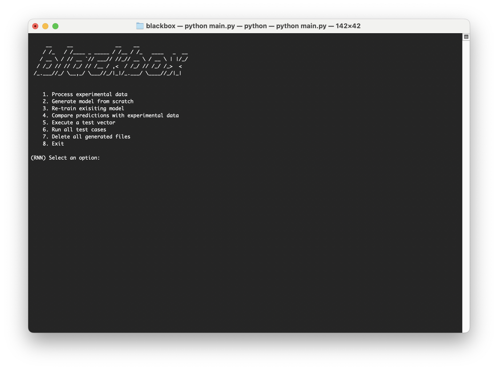

# Blackbox 

This project is a Python-based implementation of Feed-Forward Neural Networks (FNN) and Recurrent Neural Networks (RNN) for modeling dynamical systems. The project is part of a thesis focusing on the application of neural networks to model a magnetic braking system (also known as an Eddy current brake) and its dynamical behavior based on experimental data readings.

While the primary focus is on Eddy current brakes, the architecture of this software is designed to be versatile. Theoretically, this project can be used to model any dynamical system or even any system whose inputs and outputs can be measured. To do so, you will only need to modify the [`data_processing.py`](utils/data_processing.py) file to suit your needs.



### Requirements

- Python 3.x (Tested with Python 3.8.17)
- Libraries specified in `requirements.txt`

### Installation

1. Clone this repository.
    ```bash
    git clone https://github.com/alex-spataru/blackbox
    ```
2. Navigate to the project directory.
    ```bash
    cd blackbox
    ```
3. Install the required libraries.
    ```bash
    pip install -r requirements.txt
    ```

### Usage

To run the software, simply execute `main.py`:

```bash
python main.py
```

#### Prediction/experimental data comparison example


### Feedback mechanism

Unlike traditional neural network models, this setup feeds the output predictions back into the model as inputs. Additionally, the derivatives of each feedback signal are included to capture dynamic behaviors effectively. This mechanism is particularly vital for modeling dynamic systems & greatly improves model performance.

#### Neural Network Architectures

Below are the architectures for the Feed-Forward and Recurrent Neural Networks used in this project:

**FNN Architecture:**


**RNN Architecture:** 


#### Training Process

The image below provides an overview of the entire training process:


### Test Vectors

Test vectors are used for validating the neural network models and they follow a specific format:

```
$TIME 10.0
$STEP_SIZE 0.02

$INPUT Reference 3
0.00   0
3.00   0
9.00   100

$INPUT Distance 1
0.00   1.25

$INPUT Temperature 1
0.00   30
```

- `$TIME`: Total simulation time.
- `$STEP_SIZE`: Time step size for the simulation.
- `$INPUT`: Defines an input signal for the simulation.
  - Following the `$INPUT` keyword, the name of the input and the number of points for that input are specified.
  - Each point is then listed with its corresponding time and value.

**Note:** We interpolate between each point to generate a continuous signal over the specified time.

### Directory Structure

Here is a brief explanation of the project directory structure:

```
blackbox/
│
├── cfg/                     # Configuration files and resources
│   ├── FNN.json             # Configuration file for FNN models
│   ├── RNN.json             # Configuration file for RNN models
│   └── RM42 Magnetic Brake/ # Resources & code related to the magnetic brake
│
├── utils/                   # Utility scripts
│   ├── data_processing.py   # Data preprocessing utilities
│   ├── model_executor.py    # Model execution class
│   ├── model_generator.py   # Neural network model generation & training
│   ├── plotting.py          # Plotting utilities
│   └── test_vector.py       # Test vector parsing
│
├── config.py                # Configuration file loader
├── main.py                  # Main script to run the project
└── requirements.txt         # Required libraries
```

#### Configuration files & extra stuff

- `FNN.json` and `RNN.json` inside the `cfg` folder are JSON files containing hyperparameters for the neural network models.
- `cfg/RM42 Magnetic Brake/` contains resources related to the magnetic brake, including experimental data, MCU code, test vectors & CAD files.

#### Utilities

- `data_processing.py`: Functions for data preprocessing.
- `model_executor.py`: Handles model training and execution.
- `model_generator.py`: Generates the specified neural network model.
- `plotting.py`: Utilities for plotting model predictions.
- `test_vector.py`: Handles the test vectors for model validation.

### License

This project is licensed under the MIT License. See the [LICENSE.md](LICENSE.md) file for details.
